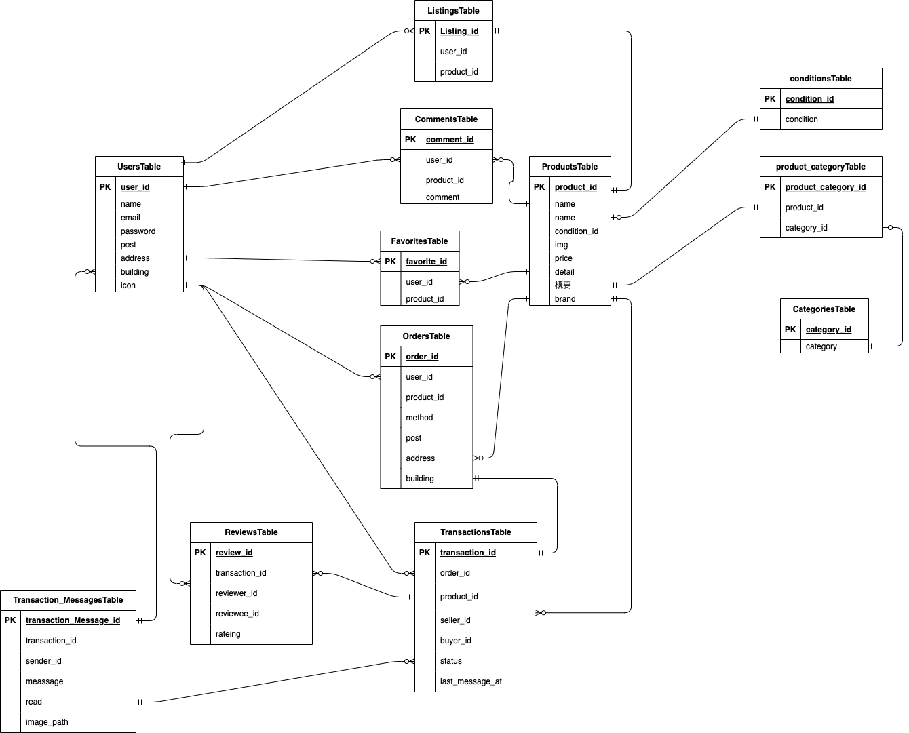

# coachtechフリマ(取引機能の実装)

## 概要
アイテムの出品と購入を行うためのフリマアプリです。
今回、商品購入後に出品者とチャットでのコミュニケーションができる機能を追加しました。

## 主な追加機能

出品者と購入者のチャット機能(出品者、購入者でもない場合は表示されない)

取引完了後の出品者と購入者による双方のレビュー機能

マイページ内に自身が受けた平均レビューの表示

マイページに取引中の商品の表示

取引完了後に出品者側へのメール送信機能

## 使用技術
laravel=8.*

php:7.4.9-fpm

mysql:8.0.26

nginx:1.21.1

## 開発環境
トップページ:http://localhost/

会員ログインページ:http://localhost/login

(ユーザーログイン後)

マイページ:http://localhost/mypage

phpmyadmin:http://localhost:8080/index.php

## セットアップ
1. リポジトリをクローン

ディレクトリ以下に、furima.gitをクローンしてリポジトリ名をfurimaProTestに変更。

git clone git@github.com:ryota10-ten/furima.git

mv furimaPro furimaProTest

cd furimaProTest

2. Docker の設定

docker compose up -d --build

code .

*furimaProtestコンテナが作成されていれば成功です。

3. Laravel のパッケージのインストール

docker-compose exec php bash

composer install

4. .env ファイルの作成

cp .env.example .env

.env.example をコピーして .env を作成。

※メール送信の設定（Mailtrap）

（１）Mailtrap のアカウント作成

Mailtrap の公式サイト（https://mailtrap.io/）にアクセスし、無料アカウントを作成してください。

（２）Mailtrap の SMTP 設定を取得

Mailtrap にログイン後、Inbox を作成

Start Testing を開く

Laravel 7+ and 8.Xの設定を選択

.env に以下の情報を設定

MAIL_MAILER=smtp

MAIL_HOST=smtp.mailtrap.io

MAIL_PORT=2525

MAIL_USERNAME=your_mailtrap_username

MAIL_PASSWORD=your_mailtrap_password

MAIL_ENCRYPTION=null

MAIL_FROM_ADDRESS=no-reply@example.com

MAIL_FROM_NAME="Furima App"

MAIL_USERNAME と MAIL_PASSWORD には Mailtrap のダッシュボードで確認できる値を入力してください。

5. アプリキーの生成

以下のコマンドを実行して、アプリケーションの暗号化キーを生成してください。

php artisan key:generate

6. ストレージのシンボリックリンク作成

php artisan storage:link

7. マイグレーションとシーディングの実装

php artisan migrate:fresh --seed

8. サーバーを起動

php artisan serve

ブラウザで
http://localhost/
にアクセスするとアプリを確認できます。

## シーディングデータ
[Uesr]
1. テスト1

出品商品ID:1〜5

取引ID:1,2(全て出品者)

2. テスト2

出品商品ID:6〜10

取引ID:1(購入者)

3. テスト3

出品商品:なし

取引ID:2(購入者)

## ER図

# furimaPro
